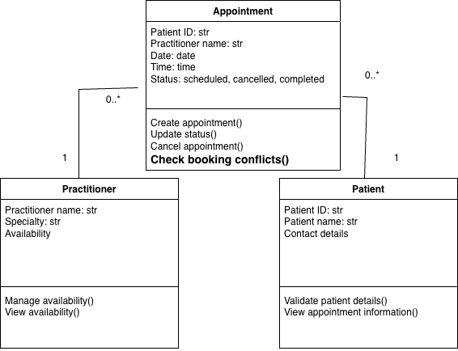

Week 6 student resource

# Requirement-to-Concept Trace

<table>
<colgroup>
<col style="width: 25%" />
<col style="width: 25%" />
<col style="width: 25%" />
<col style="width: 25%" />
</colgroup>
<thead>
<tr>
<th>Requirement</th>
<th>Concept</th>
<th>State/behavior</th>
<th>Decision</th>
</tr>
</thead>
<tbody>
<tr>
<td>FR-01: The system shall allow staff or patient to create an
appointment.</td>
<td>Appointment</td>
<td>
State: patient ID, practitioner name, date, time and status.

Behavior: create appointment.
</td>
<td>Appointment class</td>
</tr>
<tr>
<td>FR-02: The system shall allow staff or patient to cancel an
appointment</td>
<td>Appointment</td>
<td>
State: appointment status.

Behavior: cancel appointment; update status.
</td>
<td>Appointment class</td>
</tr>
<tr>
<td>FR-03: The system shall retain cancelled appointments</td>
<td>Appointment</td>
<td>State: patient ID, practitioner name, date, time and status.</td>
<td>
Appointment class.

Record storage will be considered at the design stage
</td>
</tr>
<tr>
<td>FR-04: The system shall allow staff to view and manage practitioner
availability.</td>
<td>Practitioner</td>
<td>
State: practitioner availability.

Behavior: view and manage availability.
</td>
<td>Practitioner class</td>
</tr>
<tr>
<td>FR-05: The system shall allow staff to create and store patient
records.</td>
<td>Patient</td>
<td>
State: patient ID, name and contact details.

Behavior: create patient record.
</td>
<td>
Patient class.

Record storage will be considered at the design stage.
</td>
</tr>
<tr>
<td>FR-06: The system shall allow staff to update appointment
status.</td>
<td>Appointment</td>
<td>
State: appointment status.

Behavior: update appointment status.
</td>
<td>Appointment class.</td>
</tr>
<tr>
<td>FR-07: The system shall allow staff to update patient records.</td>
<td>Patient</td>
<td>
State: patient ID, name and contact details.

Behavior: update patient details.
</td>
<td>Patient class.</td>
</tr>
<tr>
<td>FR-08: The system shall generate basic operational reports.</td>
<td style="text-align: center;">-</td>
<td style="text-align: center;">-</td>
<td>Consider at a later design stage</td>
</tr>
<tr>
<td>FR-09: The system shall check for booking conflicts.</td>
<td>
Appointment

Practitioner
</td>
<td>
State: appointment date and time; practitioner availability.

Behavior: check booking conflicts.
</td>
<td>Appointment and Practitioner classes</td>
</tr>
<tr>
<td>FR-10: The system shall allow staff to search for patient
records</td>
<td>Patient</td>
<td>State: patient ID, name.</td>
<td>
Patient class.

The search function will be considered with record storage at the
design stage.
</td>
</tr>
</tbody>
</table>

# CRC Cards

## Patient

| Responsibilities | Collaborators |
|----|----|
| Maintain patient identity and basic information, including patient ID, name and contact details |  |
| Validate patient details and view appointment information and status | Appointment |

## Practitioner

| Responsibilities | Collaborators |
|----|----|
| Maintain practitioner information, including name and specialty |  |
| Provide and manage availability for appointments | Appointment |

## Appointment

| Responsibilities | Collaborators |
|----|----|
| Maintain appointment details, including the patient, practitioner, date, time and status | Patient, Practitioner |
| Process booking, cancellation, status changes and check booking conflicts | Patient, Practitioner |

## Optional class

| Responsibilities | Collaborators |
|------------------|---------------|
|                  |               |
|                  |               |

# UML Class Diagram

Insert/draw UML here. Include defensible relationships and
multiplicities.

# Design Rationale

Explain class selection, responsibility allocation and key
relationships.

| Class | Class Selection | responsibility allocation | key relationships |
|----|----|----|----|
| Patient | Patient is selected because it has common attributes, including patient ID, name and contact details, and responsibilities related to patient information. | Patient maintains patient information because patient ID, name and contact details belong to the patient. It also needs to validate patient details and view appointment information and status to ensure the information is correct. | Patient is related to Appointment because patients need to make appointments to see practitioners. |
| Practitioner | Practitioner is selected because it has common attributes, including name, specialty and availability, and responsibilities related to practitioner availability. | Practitioner maintains practitioner information because name, specialty and availability belong to the practitioner. It also needs to provide and manage availability so appointments can be arranged according to its availability. | Practitioner is related to Appointment because appointments need to be arranged with practitioners according to their availability. |
| Appointment | Appointment is selected because it has attributes, including patient ID, practitioner name, date, time and status, and behaviors such as booking, cancellation and status changes. | Appointment maintains appointment information because patient ID, practitioner name, date, time and status are included in the appointment. It also needs to process booking, cancellation and status changes to support the daily operation of the clinic. | Appointment is related to Patient and Practitioner because an appointment connects a patient with a practitioner. |

# AI Design Review Record

<table>
<colgroup>
<col style="width: 32%" />
<col style="width: 17%" />
<col style="width: 12%" />
<col style="width: 23%" />
<col style="width: 14%" />
</colgroup>
<thead>
<tr>
<th>AI suggestion</th>
<th>Evidence</th>
<th>Decision</th>
<th>Reason</th>
<th>Model change</th>
</tr>
</thead>
<tbody>
<tr>
<td><strong>Patient Class. Responsibilities: store and manage patient
information; support retrieval of patient records. Collaborator:
Appointment. Relationship: one Patient may be associated with multiple
Appointments.</strong></td>
<td>"support patient management"; "difficulty locating patient
records"</td>
<td>Modified</td>
<td>Record retrieval does not need to be a responsibility of the Patient
class because the search function will be considered with record storage
at the design stage.</td>
<td>No change.</td>
</tr>
<tr>
<td><strong>Practitioner Class. Responsibilities: store and manage
practitioner information; maintain practitioner availability
information. Collaborator: Appointment. Relationship: one Practitioner
may be associated with multiple Appointments.</strong></td>
<td>"support practitioner management"; "limited visibility of
practitioner availability"</td>
<td>Accepted</td>
<td>
The practitioner needs to maintain its name and specialty because
this information belongs to the practitioner. It also needs to manage
availability because appointments are arranged according to practitioner
availability.

And appointment is a collaborator because an appointment needs
practitioner information and availability.
</td>
<td>No change. Practitioner information is already specified as name and
specialty in my model.</td>
</tr>
<tr>
<td><strong>Appointment Class. Responsibilities: manage appointment
bookings; maintain appointment status information; support appointment
cancellation; prevent duplicate appointment bookings; maintain reliable
appointment history. Collaborators: Patient and Practitioner.
Relationships: each Appointment links one Patient and one Practitioner;
a Patient may have multiple Appointments; a Practitioner may have
multiple Appointments.</strong></td>
<td>"support appointment management"; "duplicate appointment bookings";
"inconsistent appointment status information"; "manual cancellation
processes"; "lack of reliable appointment history"</td>
<td>Modified</td>
<td>Booking, cancellation, status changes and preventing duplicate
bookings are related to Appointment. Appointment history is also needed,
but how to store and manage the history should be considered at the
design stage.</td>
<td>Update the Appointment behaviour to check booking conflicts to
prevent duplicate bookings.</td>
</tr>
<tr>
<td><strong>Patient–Appointment Relationship. One Patient may be
associated with multiple Appointments because appointment management
must be linked to patient management.</strong></td>
<td>"support patient management"; "support appointment management"</td>
<td>Rejected</td>
<td>This relationship was already included and considered in the
previous Patient class suggestion, so it does not add new information to
the model.</td>
<td>No change.</td>
</tr>
<tr>
<td><strong>Practitioner–Appointment Relationship. One Practitioner may
be associated with multiple Appointments because appointments must
involve practitioners.</strong></td>
<td>"support practitioner management"; "support appointment
management"</td>
<td>Rejected</td>
<td>This relationship was already included and considered in the
previous Practitioner class suggestion, so it does not add new
information to the model.</td>
<td>No change.</td>
</tr>
<tr>
<td><strong>Appointment Responsibility: Maintain Appointment Status.
Appointment should maintain consistent status information for
appointments.</strong></td>
<td>"inconsistent appointment status information"</td>
<td>Rejected</td>
<td>This responsibility was already included and considered in the
previous Appointment class suggestion, so it does not add new
information to the model.</td>
<td>No change.</td>
</tr>
<tr>
<td><strong>Appointment Responsibility: Support Cancellation.
Appointment should support cancellation processing rather than relying
entirely on manual procedures.</strong></td>
<td>"manual cancellation processes"</td>
<td>Rejected</td>
<td>This responsibility was already included and considered in the
previous Appointment class suggestion, so it does not add new
information to the model.</td>
<td>No change.</td>
</tr>
<tr>
<td><strong>Appointment Responsibility: Prevent Duplicate Bookings.
Appointment should enforce business rules that prevent duplicate
bookings.</strong></td>
<td>"duplicate appointment bookings"</td>
<td>Rejected</td>
<td>This responsibility was already included and considered in the
previous Appointment class suggestion, so it does not add new
information to the model.</td>
<td>No change.</td>
</tr>
<tr>
<td><strong>Appointment Responsibility: Maintain Appointment History.
Appointment should maintain reliable historical booking
information.</strong></td>
<td>"lack of reliable appointment history"</td>
<td>Rejected</td>
<td>This responsibility was already included and considered in the
previous Appointment class suggestion, so it does not add new
information to the model.</td>
<td>No change.</td>
</tr>
<tr>
<td><strong>Patient Responsibility: Support Record Retrieval. Patient
information should be organised so records can be located
efficiently.</strong></td>
<td>"difficulty locating patient records"</td>
<td>Rejected</td>
<td>This responsibility was already included and considered in the
previous Patient class suggestion, so it does not add new information to
the model.</td>
<td>No change.</td>
</tr>
<tr>
<td><strong>Practitioner Responsibility: Maintain Availability
Information. Practitioner should provide visibility of availability
information.</strong></td>
<td>"limited visibility of practitioner availability"</td>
<td>Rejected</td>
<td>This responsibility was already included and considered in the
previous Practitioner class suggestion, so it does not add new
information to the model.</td>
<td>No change.</td>
</tr>
</tbody>
</table>
