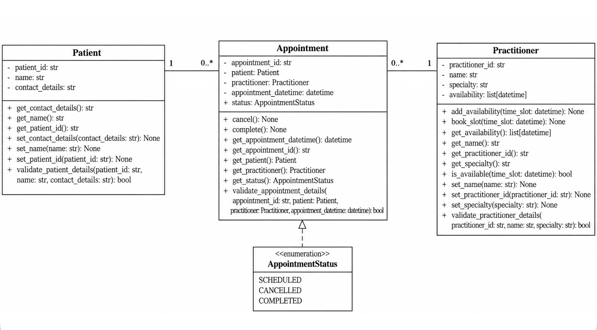

Week 7 student resource

# 1. UML-to-Code Trace

<table>
<colgroup>
<col style="width: 31%" />
<col style="width: 34%" />
<col style="width: 33%" />
</colgroup>
<thead>
<tr>
<th>UML element</th>
<th>Python element</th>
<th>Implemented</th>
</tr>
</thead>
<tbody>
<tr>
<td><strong>Patient class</strong></td>
<td>Patient class</td>
<td>yes</td>
</tr>
<tr>
<td>patient ID</td>
<td>patient_id: str</td>
<td>self.__patient_id</td>
</tr>
<tr>
<td>patient name</td>
<td>name: str</td>
<td>self.__name</td>
</tr>
<tr>
<td>contact details</td>
<td>contact_details: str</td>
<td>self.__contact_details</td>
</tr>
<tr>
<td>validate patient details()</td>
<td>validate_patient_details()</td>
<td>yes</td>
</tr>
<tr>
<td>view appointment information()</td>
<td>Not implemented</td>
<td>no, the view appointment function is not implemented in the current
design</td>
</tr>
<tr>
<td>Practitioner class</td>
<td>Practitioner class</td>
<td>yes</td>
</tr>
<tr>
<td>practitioner ID</td>
<td>practitioner_id: str</td>
<td>self.__practitioner_id</td>
</tr>
<tr>
<td>practitioner name</td>
<td>name: str</td>
<td>self.__name</td>
</tr>
<tr>
<td>specialty</td>
<td>specialty: str</td>
<td>self.__specialty</td>
</tr>
<tr>
<td>availability</td>
<td>availability</td>
<td>self.__availability</td>
</tr>
<tr>
<td>manage availability()</td>
<td>
add_availability(),

book_slot()
</td>
<td>add and remove available time slots</td>
</tr>
<tr>
<td>view availability()</td>
<td>
get_availability(),

is_available()
</td>
<td>Return availability and check whether a time slot is available</td>
</tr>
<tr>
<td>Appointment class</td>
<td>Appointment class</td>
<td>yes</td>
</tr>
<tr>
<td>appointment ID</td>
<td>appointment_id: str</td>
<td>self.__appointment_id</td>
</tr>
<tr>
<td>date and time</td>
<td>appointment_datetime: datetime</td>
<td>self.__appointment_datetime</td>
</tr>
<tr>
<td>create appointment()</td>
<td>__init__()</td>
<td>create the appointment in __init__()</td>
</tr>
<tr>
<td>cancel appointment()</td>
<td>cancel ()</td>
<td>set status to CANCELLED and return the time slot to
availability</td>
</tr>
<tr>
<td>update status()</td>
<td>
cancel(),

complete()
</td>
<td>Set status to CANCELLED or COMPLETED</td>
</tr>
<tr>
<td>check booking conflicts()</td>
<td>practitioner.is_available()</td>
<td>check whether the appointment time is available before booking</td>
</tr>
<tr>
<td>status</td>
<td>AppointmentStatus</td>
<td>SCHEDULED, CANCELLED, COMPLETED</td>
</tr>
</tbody>
</table>

# 2. Domain Invariants

| Class | Invariant / rule | How protected |
|----|----|----|
| Patient | Patient ID, contact details and name cannot be empty. All patient data must follow the related patient rules. | Use encapsulation and make attributes private. Validate empty attributes. Raise an error for invalid input. Use mutator methods to modify attributes. |
| Practitioner | Practitioner ID, specialty and name cannot be empty. | Use encapsulation and make attributes private. Validate values in set methods. Change state only through class methods. |
| Appointment | Appointment ID cannot be empty. Related Patient and Practitioner must be valid. Date and time must be valid. Invalid or repeated status transitions are not permitted. | Use encapsulation and make attributes private. Validate the related Patient, Practitioner, date and time. Check status transition rules through methods. Change state only through class methods. |
|  |  |  |
|  |  |  |
|  |  |  |

# 3. Composition / Inheritance Decisions

| Relationship | Decision | Rationale |
|----|----|----|
| Patient and Appointment | Reference relationship | Appointment references a Patient because each appointment is associated with a patient. |
| Practitioner and Appointment | Reference relationship | Appointment references a Practitioner because each appointment is associated with a practitioner. |
|  |  |  |
|  |  |  |
|  |  |  |

# 4. AI Pair-Programming Record

| AI contribution | Conforms | Decision | Reason | Verification |
|----|----|----|----|----|
| Generated the Appointment class with Patient and Practitioner associations, type hints and AppointmentStatus enum. | Yes, after modification | Modified | The generated code followed the approved UML and matched the Patient and Practitioner classes I provided. I also modified the Appointment class to work with practitioner availability and booking checks. | Created valid Patient, Practitioner and Appointment objects and checked that the associations and booking worked correctly. |
| Suggested using raise statements for validation and error handling. | Yes | Accepted | Raise provides consistent error handling for invalid input and operations. I changed Patient and Practitioner to use raise too. | Tested invalid Patient input and confirmed that an error was raised. |
| Suggested adding validation using empty-value checks and isinstance() checks. | Yes | Accepted | The validation protects Appointment from invalid ID, Patient, Practitioner and date/time input. | Reviewed the validation checks and confirmed that they were included in the Appointment class. |
| Suggested using cancel() and complete() to manage appointment status transitions. | Yes | Accepted | The methods control status changes and prevent invalid or repeated status transitions. | Cancelled a scheduled appointment and tried to cancel it again. The second cancellation raised an error. |
|  |  |  |  |  |

# 5. Updated UML

Insert updated UML only if implementation revealed a justified design
change. Explain every change.

The updated UML includes several changes from the original UML. Some
attribute and method names were slightly changed to make the naming more
consistent. The Practitioner methods manage availability() and view
availability() were changed to add_availability(), book_slot(),
get_availability() and is_available(). add_availability() adds an
available time slot, book_slot() removes the time slot after it is
booked, get_availability() returns the available time slots, and
is_available() checks whether a specific time slot is available. This
makes each availability method have a clearer responsibility. In
Appointment, create appointment() is represented by \_\_init\_\_()
because the appointment is created when the object is initialized.
update status() is represented by cancel() and complete() because each
method handles a specific status change and checks whether the change is
allowed. check booking conflicts() is represented by
practitioner.is_available() because it checks whether the time slot is
still available before booking, which prevents the same time slot from
being booked again. An AppointmentStatus enum was added to limit the
appointment status to SCHEDULED, CANCELLED and COMPLETED. Validation
methods were added to check the input and prevent invalid data. Getter
and setter methods were added because the attributes are private and
need methods to access or change them. The view appointment
information() method in Patient was removed because this function has
not reached the implementation stage.
