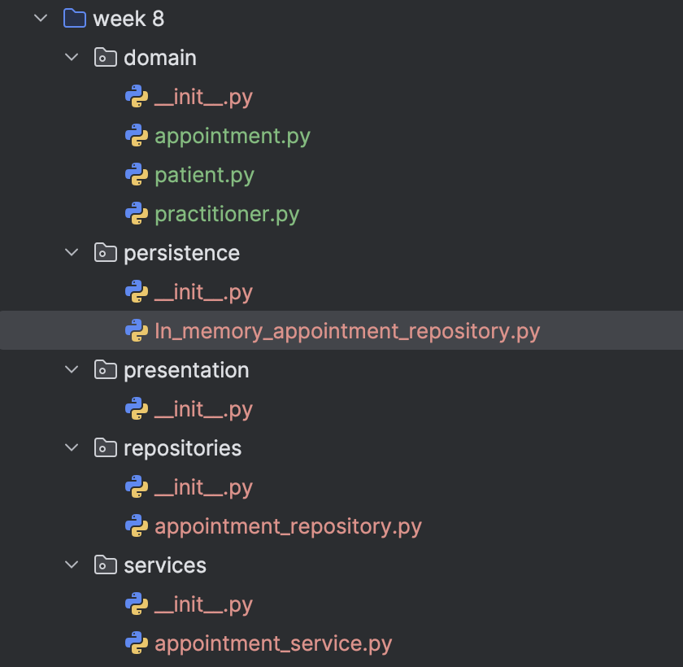

HUMAN ANALYSIS -\> REFACTOR -\> AI REVIEW -\> VERIFY \| 1 hour

# A - Inspect SmartCare v0.4

**Identify domain, workflow, data-access and presentation responsibilities currently mixed together.**

In SmartCare v0.4, the Appointment class mixes domain behaviour with workflow coordination. It checks the practitioner's availability, books the time slot when creating an appointment, and adds the time slot back when an appointment is cancelled. This means Appointment is responsible for both domain behaviour and part of the booking workflow. The workflow coordination should be moved to AppointmentService. Availability-related behaviour should remain in Practitioner.

# B - Propose Architecture

**Draw Presentation -\> Service -\> Domain, with Service using a Repository abstraction and Persistence implementing it.**

SmartCare_v0.5_Architecture_Diagram SmartCare_v0.5_Updated_Architecture_Diagram

# C - Create Package Structure

**Create domain/, services/, repositories/, persistence/ and presentation/ or a justified equivalent.** 

# D - Introduce AppointmentService

**Move workflow coordination into a focused service without stealing Appointment domain behaviour**.

AppointmentService coordinates the appointment workflow for creating and cancelling appointments. It manages appointment creation, practitioner availability, and repository operations. Practitioner availability checking, slot booking, and availability restoration are removed from the Appointment class and handled by the service. Appointment keeps its own domain behaviour, including cancel() and complete().

# E - Repository Abstraction

**Define a small AppointmentRepository contract using only current use-case needs.**

Based on the current appointment use cases, the AppointmentRepository contract was defined with four operations: save(), find_by_id(), find_all(), and update().  
Save() stores a new appointment in the repository.  
Find_by_id() finds an appointment by its ID.  
Find_all() retrieves all appointments from the repository.  
Update() updates an existing appointment in the repository.

# F - AI Architecture Review

**Ask AI to review dependency direction, misplaced responsibilities and unnecessary complexity; request simplest justified improvements.**

AI review identified four suggestions:  
1. Clarify the dependency between AppointmentService and AppointmentRepository.  
2. Remove the unnecessary print ("Appointment not found") from the repository.  
3. Move cancel () and complete () from Appointment to AppointmentService.  
4. Consider returning a copy from get_availability().

# G - Refactor and Verify

**Apply only justified changes and confirm required behaviour remains unchanged.**

| AI suggestion | Observed problem? | Decision | Reason | Verification |
|----|----|----|----|----|
| The architecture diagram does not clearly show that AppointmentService depends on AppointmentRepository. | The current architecture diagram does not clearly show the dependency between AppointmentService and AppointmentRepository. | Accepted | The dependency direction should reflect the layered architecture. AppointmentService uses the AppointmentRepository contract for appointment data operations. The persistence layer provides its implementation. | Checked the updated architecture diagram and confirmed that the dependency direction matches the relationships. |
| The repository contains print("Appointment not found") even though AppointmentService already handles this case. | InMemoryAppointmentRepository.find_by_id() contains print("Appointment not found"), but AppointmentService already handles the appointment-not-found condition. | Accepted | The repository should focus on appointment data operations. AppointmentService should handle the appointment-not-found condition as part of the appointment workflow. | Tested an invalid appointment ID and confirmed that AppointmentService raises the expected error. |
| Move cancel() and complete() from Appointment to AppointmentService. | No, cancel() and complete() belong to the Appointment domain behaviour. | Rejected | cancel() and complete() contain appointment status rules, so they should remain in the Appointment domain class. Moving them to AppointmentService would move domain behaviour out of the Domain layer. | Checked the Appointment class and confirmed that cancel() and complete() only manage appointment status and its related business rules. |
| get_availability() returns the internal availability list directly. Consider returning a copy instead. | A potential risk was identified. | Modified | The suggestion identifies a possible encapsulation risk. The issue will be considered in future development, but returning a copy is not required for the current use cases. | Reviewed the current Domain and Service code and confirmed that the availability list is not modified through get_availability(). |

# H - Reflection

**Document one AI suggestion accepted, one modified and one rejected/deferred.**

AI provided several suggestions for the SmartCare system. After reviewing these suggestions, I selected one example for each decision: Accepted, Modified, and Rejected. The following reflection explains the reasons for each decision.

Accepted: Architecture dependency  
AI suggested that the architecture diagram did not clearly show the dependency between AppointmentService and AppointmentRepository. Due to my limited understanding of the dependency between the layers, I followed the reference diagram to create the original diagram. After reviewing the AI suggestion, I understood that AppointmentService calls AppointmentRepository for appointment data operations. I accepted the suggestion because this relationship should be shown in the architecture diagram, and the original connection to the Domain layer did not represent the actual dependency. I updated the diagram to show the dependency from AppointmentService to AppointmentRepository.

Modified: get_availability()  
AI suggested that get_availability() should return a copy of the availability list because it currently returns the internal list directly. I modified this suggestion because the current functionality does not involve this issue, and I decided to keep the current implementation at this stage. If future functionality involves this issue, I will consider the risk and decide how to prevent it based on the specific requirements.

Rejected: cancel() and complete()  
AI suggested moving cancel() and complete() from Appointment to AppointmentService. I rejected this suggestion because these methods contain the appointment status rules and are part of the Appointment domain behaviour. AppointmentService coordinates the appointment workflow, and Appointment manages its own status. Moving these methods to the Service layer would move domain behaviour out of the Domain layer.

# Suggested AI prompt

Act as a software architecture reviewer. Review this small SmartCare Python system against separation of concerns, cohesion, coupling and introductory SOLID principles. Identify concrete layer violations and dependency risks. Prefer the simplest refactoring that solves an observed problem. Do not introduce frameworks, microservices or patterns unless current requirements justify them.
