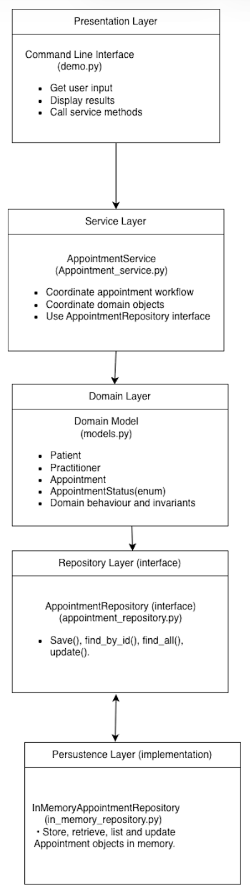
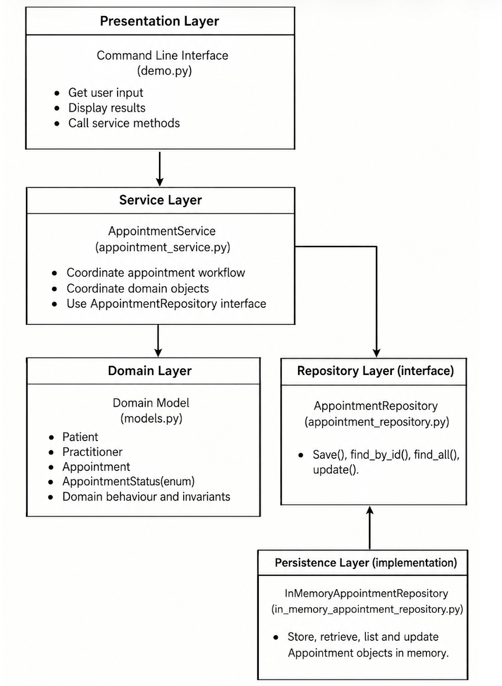

Week 8 student resource

# Current Architecture Problems

| Problem | Evidence | Impact | Refactoring |
|----|----|----|----|
| Appointment directly coordinates Practitioner availability. | Appointment checks the practitioner's availability and books the time slot when creating an appointment. It also adds the time slot back when the appointment is cancelled. | Appointment is responsible for part of the booking workflow. | Move the workflow coordination to AppointmentService. Keep availability methods in Practitioner. |
| There is no Repository abstraction. | The current code contains Patient, Practitioner and Appointment, but there is no AppointmentRepository contract. | The Service Layer would have no clear abstraction for accessing appointment data. | Define the AppointmentRepository with the methods required by the current requirements: save(), find_by_id(), find_all(), and update(). |
| There is no Persistence Layer. | The current code contains the domain classes, but there is no separate database or storage layer. | Data storage is not separated from the application design. | Add a Persistence Layer behind the Repository abstraction using an in-memory implementation. |
| There is no Presentation Layer. | The current code contains domain classes, but there is no code for user input or displaying information. | User interaction is not separated from the application logic. | Add a Presentation Layer to handle user input and display output. |
|  |  |  |  |
|  |  |  |  |
|  |  |  |  |

# Layer Responsibilities

| Layer | Responsibilities | Must not contain |
|----|----|----|
| Presentation | Handle user input and display appointment and patient information. | Business rules, repository operations, database operations |
| Service | Coordinate the appointment workflow, including checking appointment details, checking practitioner availability, and booking a time slot with the practitioner. It coordinates the existing domain behaviour for creating, cancelling and completing appointments. | SQL, database operations, detailed domain rules |
| Domain | Represent patients, practitioners and appointments, and contain their business rules. | User input/output, repository operations, database operations |
| Repository | Provide the AppointmentRepository contract required by the current requirements: save() a new appointment, find_by_id() an appointment, find_all() appointments, and update() an existing appointment. | SQL, database connection details, business rules |
| Persistence | Implement the AppointmentRepository operations using in-memory storage. It handles storing, retrieving, listing and updating appointment objects in memory. | Business rules, appointment workflow, user input/output |

# Architecture Diagram

**Insert SmartCare v0.5 architecture and dependency direction.**

SmartCare_v0.5_Architecture_Diagram    SmartCare_v0.5_Updated_Architecture_Diagram

# SOLID Review

| Principle | Relevant? | Evidence | Decision |
|----|----|----|----|
| SRP | Yes | The responsibilities are separated across the architecture. Presentation handles user interaction, AppointmentService coordinates the appointment workflow, domain classes handle business behaviour, AppointmentRepository defines the data-access methods, and InMemoryAppointmentRepository handles appointment storage operations. | Keep each component focused on its own responsibility and avoid mixing different responsibilities in the same component. |
| OCP | Yes | The repository abstraction allows the appointment workflow to remain unchanged when a different repository implementation is used. | Keep AppointmentService independent from the specific repository implementation. |
| LSP | Yes | InMemoryAppointmentRepository implements the methods defined by the AppointmentRepository interface. | Ensure InMemoryAppointmentRepository follows the AppointmentRepository interface correctly. |
| ISP | Yes | AppointmentRepository contains only the methods required by the current use cases: save(), find_by_id(), find_all(), and update(). | Keep only the methods needed by the current use cases in AppointmentRepository. |
| DIP | Yes | AppointmentService depends on the AppointmentRepository interface, not directly on InMemoryAppointmentRepository. | Keep AppointmentService dependent on the AppointmentRepository interface, not on the specific repository implementation. |

# AI Architecture Review

| AI suggestion | Observed problem? | Decision | Reason | Verification |
|----|----|----|----|----|
| The architecture diagram does not clearly show that AppointmentService depends on AppointmentRepository. | The current architecture diagram does not clearly show the dependency between AppointmentService and AppointmentRepository. | Accepted | The dependency direction should reflect the layered architecture. AppointmentService uses the AppointmentRepository contract for appointment data operations. The persistence layer provides its implementation. | Checked the updated architecture diagram and confirmed that the dependency direction matches the relationships. |
| The repository contains print("Appointment not found") even though AppointmentService already handles this case. | InMemoryAppointmentRepository.find_by_id() contains print("Appointment not found"), but AppointmentService already handles the appointment-not-found condition. | Accepted | The repository should focus on appointment data operations. AppointmentService should handle the appointment-not-found condition as part of the appointment workflow. | Tested an invalid appointment ID and confirmed that AppointmentService raises the expected error. |
| Move cancel() and complete() from Appointment to AppointmentService. | No, cancel() and complete() belong to the Appointment domain behaviour. | Rejected | cancel() and complete() contain appointment status rules, so they should remain in the Appointment domain class. Moving them to AppointmentService would move domain behaviour out of the Domain layer. | Checked the Appointment class and confirmed that cancel() and complete() only manage appointment status and its related business rules. |
| get_availability() returns the internal availability list directly. Consider returning a copy instead. | A potential risk was identified. | Modified | The suggestion identifies a possible encapsulation risk. The issue will be considered in future development, but returning a copy is not required for the current use cases. | Reviewed the current Domain and Service code and confirmed that the availability list is not modified through get_availability(). |
|  |  |  |  |  |
|  |  |  |  |  |
